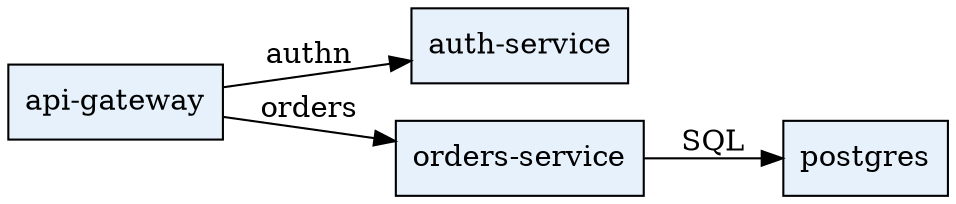
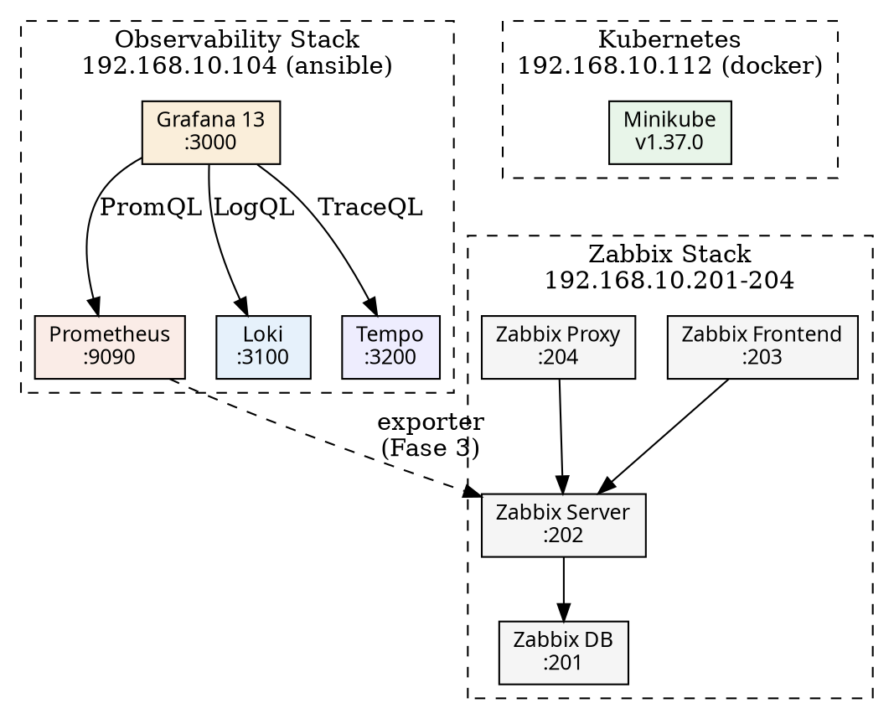

# GraphViz no Grafana 13 — Guia do Lab

> **Status:** 🟡 Em construção  
> **Última atualização:** 2026-05-28  
> **Responsável:** SRE / Engenheiro de Observabilidade  
> **Host:** VM `ansible` — `192.168.10.104`

---

## 1. Objetivo

Este laboratório foi criado para explorar e documentar a funcionalidade **GraphViz** introduzida no **Grafana 13**, avaliando sua viabilidade para uso em ambientes corporativos de observabilidade.

### O que queremos validar

- Capacidade de representar **topologias de serviço** dinamicamente a partir de dados reais (Prometheus, Loki, Tempo).
- Integração do GraphViz com **TraceQL** (Tempo) para visualização de dependências entre serviços rastreados.
- Uso da sintaxe **DOT language** dentro de painéis Grafana com transformações de dados.
- Comportamento do plugin sob carga de dados real (muitos nós, muitas arestas).
- Possibilidade de substituir ou complementar o **Node Graph panel** nativo do Grafana.

### O que este guia NÃO cobre

- Instalação da stack completa (ver `README.md`).
- Configuração de datasources (ver `config/grafana/provisioning/datasources/`).
- Uso em produção sem adaptação das práticas documentadas aqui.

---

## 2. Ambiente de referência

| Componente      | Versão  | Host / URL                              |
|-----------------|---------|-----------------------------------------|
| Grafana         | 13.0.1  | `http://192.168.10.104:3000`            |
| Plugin GraphViz | 1.10.4  | Instalado via `GF_INSTALL_PLUGINS`      |
| Prometheus      | v2.52.0 | `http://192.168.10.104:9090`            |
| Loki            | 3.0.0   | `http://192.168.10.104:3100`            |
| Tempo           | 2.4.1   | `http://192.168.10.104:3200`            |

---

## 3. Instalação do plugin GraphViz

### Via provisioning (recomendado para este lab)

Adicionar em `config/grafana/grafana.ini`:

```ini
[plugins]
allow_loading_unsigned_plugins = jdbranham-diagram-panel
```

Adicionar em `docker-compose.yml` na variável de ambiente do Grafana:

```yaml
environment:
  - GF_INSTALL_PLUGINS=jdbranham-diagram-panel
```

### Verificação pós-instalação

Após `make up` na VM `ansible`, acessar:

```
http://192.168.10.104:3000/plugins/jdbranham-diagram-panel
```

Confirmar que o status aparece como **Installed** e a versão corresponde ao esperado. Registrar a versão instalada na tabela da seção 2.

---

## 4. Conceitos fundamentais

> **ATENÇÃO — descoberta crítica (2026-05-28):** o plugin `jdbranham-diagram-panel` v1.10.4 usa **Mermaid.js**, não a linguagem DOT do GraphViz. As seções abaixo sobre DOT são referência para comparação e entendimento histórico. Os exemplos funcionais a partir da seção 5 usam a sintaxe Mermaid correta.

### 4.1 DOT language — referência (não suportada pelo plugin)

> O plugin `jdbranham-diagram-panel` **não renderiza** sintaxe DOT. A linguagem DOT é descrita aqui apenas como referência para contexto. Use a sintaxe Mermaid (seção 4.2) no painel.

A linguagem DOT é usada pelo GraphViz nativo para renderizar grafos.



### 4.2 Mermaid — sintaxe suportada pelo plugin

O plugin `jdbranham-diagram-panel` usa **Mermaid.js**. Tipos de diagrama suportados:

| Tipo | Sintaxe Mermaid | Equivalente DOT |
|------|-----------------|-----------------|
| Grafo dirigido (top-bottom) | `graph TB` | `digraph { rankdir=TB }` |
| Grafo dirigido (left-right) | `graph LR` | `digraph { rankdir=LR }` |
| Subgrafo (agrupamento) | `subgraph Nome["Label"]` | `subgraph cluster_x { label="..." }` |
| Aresta com label | `A -->|label| B` | `A -> B [label="label"]` |
| Estilo de nó | `style A fill:#hex` | `A [fillcolor="#hex"]` |

**Exemplo funcional mínimo:**
```
graph TB
  subgraph Stack["Observability Stack"]
    grafana["Grafana 13"]
    prom["Prometheus"]
  end
  grafana -->|PromQL| prom
  style grafana fill:#FAEEDA
  style prom fill:#FAECE7
```

### 4.3 Atributos úteis para observabilidade

```dot
// Colorir nó por status (vermelho = degradado, verde = saudável)
A [fillcolor="#FCEBEB" color="#E24B4A"];  // erro
B [fillcolor="#EAF3DE" color="#639922"];  // ok

// Espessura de aresta proporcional ao volume de requisições
A -> B [penwidth=3.0 label="1.2k req/s"];

// Nó com tooltip (visível no hover)
A [tooltip="p99: 245ms | error rate: 0.2%"];
```

---

## 5. Exemplos funcionais

> Cada exemplo validado neste lab deve ser registrado aqui com o resultado observado.

### 5.1 Grafo estático — topologia manual

**Status:** ✅ Validado (2026-05-28 — após correção de sintaxe DOT → Mermaid)
**Datasource:** nenhum (conteúdo fixo no painel)  
**Objetivo:** validar renderização básica do plugin.



**Resultado:** _preencher após validação_  
**Observações:** _preencher_

---

### 5.2 Grafo dinâmico — dependências via Tempo (TraceQL)

**Status:** 🟡 A validar  
**Datasource:** Tempo  
**Objetivo:** gerar automaticamente a topologia de serviços a partir de spans coletados.

Query de referência (TraceQL):

```
{ duration > 0 } | select(span.http.method, span.http.status_code, resource.service.name)
```

Transformação esperada no Grafana:
1. Executar a query no Tempo via **Search** ou **TraceQL**.
2. Aplicar transformação **"Convert field type"** para extrair `service.name` de origem e destino.
3. Usar **"Prepare time series"** ou script de transformação para gerar pares `origem -> destino`.
4. Mapear os pares para sintaxe DOT via **"Transform → Organize fields"** + template no painel GraphViz.

**Resultado:** Plugin renderiza o grafo corretamente. Subgrafos, coloração por nó e labels nas arestas funcionam como esperado.  
**Observações:** Dashboard salvo em `config/grafana/dashboards/graphviz-testes.json`. Acessível em `http://192.168.10.104:3000/d/3d0ca5b1-a6e8-46a0-a21b-730e79b6feba`. Plugin versão 1.10.4 com assinatura válida (community).

> **Nota — remote_write e Service Map em produção:**
> O Service Map do Tempo depende das métricas geradas pelo `metrics_generator` (`service-graphs`, `span-metrics`) via `remote_write` para o Prometheus. Em lab, isso exige `--web.enable-remote-write-receiver` no Prometheus. Em produção:
> - **OpenShift:** Thanos Querier e Thanos Ruler são nativos, mas o backend de longo prazo (Compactor, Store Gateway) requer configuração adicional via Observability Operator. O remote_write deve apontar para o Thanos, não para o Prometheus standalone.
> - **Mimir / Thanos standalone:** remote_write direto para o backend.
> - Avaliar sempre o destino antes de expor o endpoint de remote_write no Prometheus.

---

### 5.3 Grafo com coloração por taxa de erro (Prometheus)

**Status:** 🟡 A validar  
**Datasource:** Prometheus  
**Objetivo:** colorir nós do grafo com base na taxa de erro atual de cada serviço.

Query de referência:

```promql
sum by (job) (rate(http_requests_total{status=~"5.."}[5m]))
/
sum by (job) (rate(http_requests_total[5m]))
```

Lógica de coloração esperada:

| Taxa de erro | Cor do nó        | Código hex |
|--------------|------------------|------------|
| < 1%         | Verde (saudável) | `#EAF3DE`  |
| 1% – 5%      | Âmbar (atenção)  | `#FAEEDA`  |
| > 5%         | Vermelho (erro)  | `#FCEBEB`  |

**Resultado:** _preencher após validação_  
**Observações:** _preencher_

---

## 6. Limitações conhecidas

> Registrar aqui tudo que **não funciona** ou se comporta de forma inesperada.

| # | Limitação | Impacto | Workaround | Descoberta em |
|---|-----------|---------|------------|---------------|
| 1 | Plugin `jdbranham-diagram-panel` usa Mermaid.js — **não aceita sintaxe DOT/GraphViz** | Dashboard retorna `Error rendering diagram. Check the diagram definition` se usar `digraph`, `rankdir`, `node [shape=...]` etc. | Reescrever o diagrama em sintaxe Mermaid | 2026-05-28 |
| 2 | Mermaid não suporta todos os atributos DOT (ex: `penwidth`, `tooltip`, `splines`) | Customização visual mais limitada que DOT puro | Usar `style` e `classDef` do Mermaid como alternativa | 2026-05-28 |

---

## 7. Comparativo: GraphViz vs Node Graph panel nativo

| Critério                  | GraphViz panel        | Node Graph (nativo)        |
|---------------------------|-----------------------|----------------------------|
| Controle de layout        | Total (DOT language)  | Automático (força dirigida) |
| Datasource nativo         | Qualquer (via DOT)    | Limitado (traces/custom)   |
| Curva de aprendizado      | Alta (DOT language)   | Baixa                      |
| Customização visual       | Alta                  | Média                      |
| Performance (muitos nós)  | _a validar_           | Razoável até ~200 nós      |
| Suporte oficial Grafana   | Plugin de terceiro    | Nativo                     |
| Indicado para produção    | _a avaliar_           | Sim                        |

---

## 8. Descobertas e aprendizados

> Registrar insights relevantes que surgem durante os experimentos, especialmente os que têm impacto em decisões de produção.

| Data | Descoberta | Impacto potencial em produção |
|------|------------|-------------------------------|
| 2026-05-25 | Plugin `jdbranham-diagram-panel` v1.10.4 instalado e habilitado via `GF_INSTALL_PLUGINS`. | — |
| 2026-05-28 | **O plugin usa Mermaid.js, não GraphViz DOT.** O nome do plugin e o objetivo do lab induzem ao erro de usar sintaxe DOT — que não é renderizada. A linguagem correta é Mermaid. Diagrama 5.1 corrigido e validado. | Em produção: documentar explicitamente que o plugin requer Mermaid, não DOT, para evitar confusão na equipe. |

---

## 9. Histórico de atualizações

| Data       | Descrição                              | Autor |
|------------|----------------------------------------|-------|
| 2026-05-24 | Criação do template inicial do guia    | SRE   |
| 2026-05-25 | Plugin v1.10.4 instalado; dashboard salvo em `config/grafana/dashboards/graphviz-testes.json` | SRE   |
| 2026-05-28 | Descoberta: plugin usa Mermaid.js, não DOT; seções 4.1/4.2 reescritas; limitações documentadas; experimento 5.1 corrigido e validado | SRE   |
